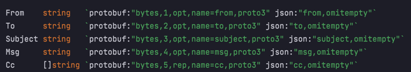

# Email Sender API
## Send messages to different emails via API


##### emailSenderApi is an API that let you to send an e-mail from/to any mail with subject and cc's.
##### To send e-mails, I used Simple Message Transport Protocol (smtp)

## Supported protocols

- HTTP POST request (via [gin](https://github.com/gin-gonic/gin))
- gRpc

## To-do
- [ ] Docker

## Done
- [x] REST support
- [x] gRpc support
- [x] DataBase logging storage (PostgreSQL)

## Usage

###### emailSenderApi requires [Golang](https://golang.org/) v1.17+ to run.
##### You will need to have a postgresql database named "logger" with user "server" on it
##### Install the dependencies and start the server.

```sh
cd emailSenderAPI/src
go mod download
go run main.go
```

###### P.S.: Docker will do this for you when I will implement it
## REST

By default the RESTful server will be runned on localhost:8080

#### For testing out I used Postman

You can use API via link localhost:8080/sendmsg

##### You need to send JSON in the next format:

| Field | Type | Meaning |
| ------ | ------ | ------ |
| from | string | From what e-mail the message should be sent |
| to | string | To whom the e-mail should be sent |
| subject | string| Subject of the e-mail |
| message |  string| Message of the e-mail |
| copy | array of strings | To whom the e-mail should be cc'd |

Example:
```sh
{"from":"fromExample@gmail.com",
"to":"toExample@gmail.com",
 "subject":"Readme instruction", 
 "message":"Our message",
 "copy": ["toWhom@gmail.com","shouldIcopy@gmail.com"]}
```
## GRPC

By default the Grpc server will be hosted on localhost:8081

GRPC is using JSON as well as REST. Scheme is almost the same


| Field | Type | Meaning |
| ------ | ------ | ------ |
| from | string | From what e-mail the message should be sent |
| to | string | To whom the e-mail should be sent |
| subject | string| Subject of the e-mail |
| **msg** |  string| Message of the e-mail |
| **cc** | array of strings | To whom the e-mail should be cc'd |

For testing out GRPC I used [evans](https://github.com/ktr0731/evans).

```sh
cd emailSenderApi
evans pkg/API/gRpc/proto/parser.proto -p 8081
----------------------------------------------
                EVANS
call Send
'from (TYPE_STRING) =>' fromMail@mail.com
'to (TYPE_STRING) =>' toMail@mail.com
'subject (TYPE_STRING) =>' subject
'msg (TYPE_STRING) =>' Message
'<repeated> cc (TYPE_STRING) =>' toWhomCopy@mail.com

CTRL-D to interrupt cc input prompt
```
### Thanks a lot for your attention. Would be appreciated if you will leave any comment on what I should have done better.
